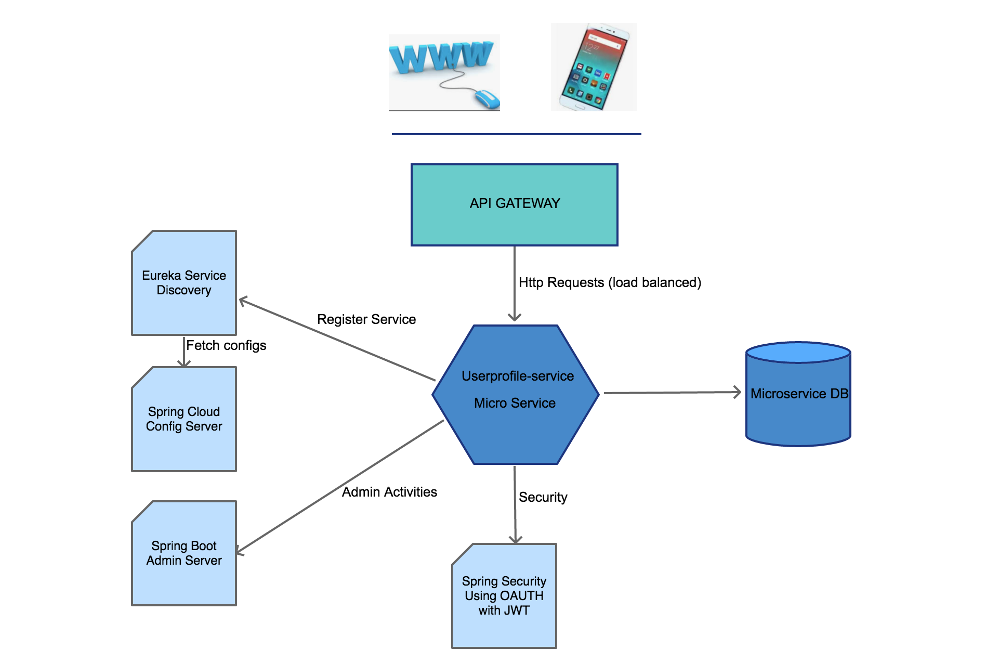
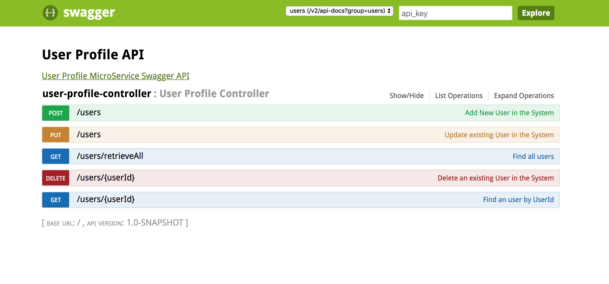

**User profile Microservice - Has a bunch of Microservices as modules**

* UserProfile Microservice             -  userprofile-service 
* Spring Cloud Config                  -  userprofile-config-server
* Eureka Discovery (Service Discovery) -  userprofile-discovery-server
* API Gateway                          -  userprofile-api-gateway 
* Admin Server                         -  userprofile-admin-server
* Hysterix Server(Circuit Breaker)     -  userprofile-hysterix-dashboard

**Architecture diagram of the Spring  Microservices**

** How to run the application on local? **

* Step1: Need to configure mysql db with the schema user and the creds of the mysql db in application.yaml of user-profile-service
* Step2: Run the microservices config, discovery, hysterix, admin, userprofile, apigateway
* Step3: Verify the Api calls in the apigateway
        eg: http://localhost:8080/api/gateway/userdetails

* Eureka Service Discovery: http://localhost:8761/
* User Profile Api Sample: http://localhost:8080/api/userprofile/users/1
                         Swagger Link :http://localhost:55973/swagger-ui.html
* Hysterix: http://localhost:7979/hystrix/monitor?stream=http%3A%2F%2Flocalhost%3A8080%2Factuator%2Fhystrix.stream
* Admin: http://localhost:9090/#/applications/API-GATEWAY
* Config Server: http://localhost:8888
